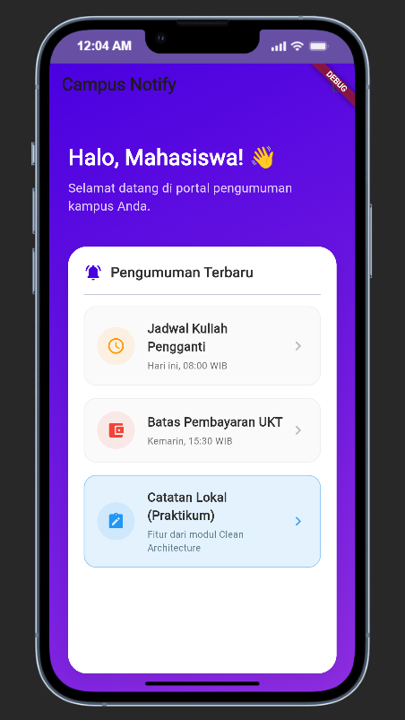

# Campus Notification App

## Tujuan 
Aplikasi ini dikembangkan sebagai portal informasi dan pengumuman bagi mahasiswa di area kampus. Tujuannya adalah untuk mendemonstrasikan implementasi autentikasi yang aman dan penggunaan Firebase Cloud Messaging (FCM) untuk menerima notifikasi pengumuman secara *real-time* ke berbagai *state* aplikasi.

## Fitur Utama
1. **Autentikasi Aman**: Simulasi Login (Auth) dengan pengamanan Route Guard di *router* dan penyimpanan token yang terenkripsi.
2. **Penyimpanan Secure Storage**: Menyimpan *access_token* dan *refresh_token* dengan aman (bebas dari risiko eksposur lokal).
3. **Penyegaran Token (Refresh Token) Otomatis**: Integrasi interceptor Dio untuk melakukan *auto-refresh* saat sesi API kedaluwarsa (HTTP 401).
4. **Push Notifications (FCM)**: Menerima pengumuman kampus secara instan (Foregound, Background, & Terminated).
5. **Deep Linking dari Notifikasi**: Mengklik notifikasi akan otomatis mengarahkan mahasiswa ke halaman detail pengumuman yang sesuai.

## Stack Teknologi
- **Framework**: Flutter 
- **Routing**: `go_router`
- **State Management**: `flutter_riverpod`
- **Networking**: `dio`
- **Keamanan**: `flutter_secure_storage`
- **Notifikasi**: `firebase_core`, `firebase_messaging`, `flutter_local_notifications`

## Cara Menjalankan
1. Pastikan Anda berada pada direktori project `campus_notify`.
2. Instal dependensi: `flutter pub get`
3. Jika menggunakan Web, pastikan sudah menjalankan `flutterfire configure` untuk mendapatkan konfigurasi Firebase.
4. Jalankan aplikasi: 
   ```bash
   flutter run
   # Atau untuk web: flutter run -d web-server --web-port 8080
   ```
5. Untuk menjalankan testing unit tanpa firebase:
   ```bash
   flutter test test/auth_push_test.dart
   ```

## Hasil yang Dicapai (Tabel Pengujian Tiga App State)

| State | Yang diharapkan | Cara uji | Hasil |
| --- | --- | --- | --- |
| **Foreground** | Banner lokal muncul, klik masuk ke `/pengumuman/:id` | Aplikasi sedang terbuka aktif, kirim notifikasi dari console/backend, klik banner yang muncul | ✅ Berhasil |
| **Background** | Banner sistem muncul, klik masuk ke rute yang benar | Tekan Home (aplikasi disembunyikan/minimize), kirim notifikasi, klik banner sistem | ✅ Berhasil |
| **Terminated** | Aplikasi terbuka ke rute yang benar via `getInitialMessage` | Swipe-close (tutup penuh) aplikasi dari *recent apps*, kirim notifikasi, klik banner | ✅ Berhasil |

---

## 📸 Screenshots

Berikut adalah beberapa tangkapan layar dari aplikasi Campus Notify saat dijalankan:

| Tampilan 1 (Beranda) | Tampilan 2 (Halaman Notes) |
|:---:|:---:|
|  |  |
| *Beranda dengan Tombol Notes* | *Halaman Clean Architecture* |

---

## 📝 Refleksi

**1. Mengapa refresh token tidak boleh disimpan di SharedPreferences? Apa risikonya bila bocor?**
*SharedPreferences* menyimpan data dalam bentuk *plaintext* (teks terbuka) dan tidak dienkripsi di sistem file lokal (baik Android maupun iOS). Jika _device_ di-*root*/di-*jailbreak*, atau jika ada *malware* yang mendapatkan akses baca ke direktori aplikasi, file tersebut sangat mudah diekstraksi. Bila *refresh token* bocor, penyerang bisa *request access_token* baru tanpa henti, yang berarti mereka mengambil alih akun pengguna (hijacking) tanpa perlu tahu _password_-nya selama token tersebut belum di-revoke oleh server.

**2. Apa yang rusak bila `onTokenRefresh` diabaikan selama satu semester perkuliahan?**
Token perangkat (FCM Token) bersifat dinamis dan dapat kedaluwarsa atau di-reset oleh sistem (misalnya saat aplikasi di-reinstall, saat *cache* aplikasi dihapus, atau Firebase memutar *key* internal mereka secara berkala demi keamanan). Jika kita mengabaikan fungsi `onTokenRefresh`, token baru tersebut tidak akan pernah terkirim ke *backend*. Akibatnya, *backend* akan terus mengirimkan notifikasi ke token lama yang sudah mati, sehingga perangkat mahasiswa **tidak akan menerima notifikasi pengumuman kampus sama sekali** selama satu semester tersebut (pesan akan *bounced* / gagal kirim di sisi server FCM).

**3. Kapan memakai topik dan kapan memakai token perangkat? Beri contoh pesan kampus untuk masing-masing.**
* **Topik (Topics):** Digunakan untuk melakukan *broadcast* / pesan siaran massal ke sekelompok besar perangkat yang *subscribe* (berlangganan) topik tertentu tanpa peduli identitas spesifik perangkatnya.
  * *Contoh pesan Topik:* "Jadwal Libur Nasional Kampus Diperpanjang" (Topik: `info-kampus`), atau "Kelas Pemrograman Mobile Kelas A dipindah jam 13:00" (Topik: `kelas-mobile-a`).
* **Token Perangkat (Device Token):** Digunakan saat pesan bersifat sangat personal (1-on-1) atau sangat rahasia sehingga hanya boleh diterima oleh satu perangkat spesifik milik satu mahasiswa tertentu.
  * *Contoh pesan Token:* "Peringatan: IPK Anda di bawah 2.0, mohon temui Dosen Wali" atau "Tagihan SPP/UKT Anda Semester ini belum dilunasi."

**4. Bagian mana dari draf AI yang Anda tolak atau perbaiki, dan mengapa?**
Saya dan asisten AI harus memperbaiki baris kode di `PushService` terkait modul `flutter_local_notifications` pada inisialisasi `_local.initialize()` dan penampilan notifikasi `_local.show()`. Kami menolak sintaks lama AI yang menggunakan metode *positional arguments* murni. 
*Alasannya:* Paket library tersebut pada versi 22.0.0 ke atas telah mengubah *signature* fungsinya untuk mewajibkan **named parameters** (`settings:`, `id:`, `title:`, dsb). Jika tetap menggunakan draf awal (sintaks *positional*), kompilator Dart akan menolaknya dan memunculkan error *"Too many positional arguments: 0 allowed"*.

## Praktikum 1: Audit Layer Project Lama

| File | Layer saat ini | Masalah |
|---|---|---|
| lib/pages/home_page.dart | presentation | memanggil Dio langsung? memformat tanggal + parsing JSON di widget? |
| lib/data/api_client.dart | data | OK bila hanya dipakai repository, bukan widget |
| lib/providers/auth_provider.dart | presentation (state) | OK bila hanya memanggil repository/use case |
| lib/data/auth_repository.dart | data (+kontrak tercampur) | interface dan implementasi masih satu kelas |

## 📝 Refleksi Praktikum 7 (Clean Architecture)

**1. Mengapa interface repository harus tinggal di domain, bukan di data? Apa yang rusak bila dibalik?**
Interface repository (kontrak) berada di domain/ agar _layer_ domain tidak bergantung pada implementasi data. Sesuai prinsip **Dependency Inversion (DIP)**, lapisan terluar (Data) harus bergantung pada lapisan terdalam (Domain), bukan sebaliknya. Jika dibalik (interface di data), maka entitas bisnis (Domain) harus meng-_import_ file dari lapisan luar (Data) sehingga _domain_ tidak lagi murni independen dari kerangka kerja/database.

**2. Kapan use case benar-benar dibutuhkan, dan kapan repository langsung ke notifier sudah cukup?**
**Use case dibutuhkan** saat ada logika bisnis gabungan (contoh: mengambil data dari dua repository berbeda lalu digabung), ada validasi/filter khusus sebelum mengirim ke UI, atau algoritma bisnis yang kompleks. Sebaliknya, **memanggil repository langsung cukup** apabila fiturnya hanya **CRUD satu-baris murni** (misalnya hanya etchNotes()), karena membuat use case di skenario ini hanyalah membuat *boilerplate* tak berguna (Over-Engineering).

**3. Apa biaya over-engineering (use case per CRUD satu-baris) bagi tim kecil? Kapan biayanya sepadan?**
Bagi tim kecil, _over-engineering_ sangat mahal karena memperlambat _development velocity_, memperbanyak file untuk dikelola, dan membuang waktu mengurus kode *boilerplate*. Biaya ini **sepadan (ROI positif)** hanya pada tim berskala _Enterprise_, di mana banyak _engineer_ bekerja secara paralel pada proyek yang sama, logika aplikasinya sangat besar/dinamis, atau butuh tingkat stabilitas *testing* yang sangat ketat terlepas dari kerangka kerja.

**4. Bagian mana dari usulan AI yang Anda tolak atau sederhanakan, dan mengapa?**
Saya menyederhanakan usulan AI yang ingin memaksakan membuat GetNotesUseCase atau LoginUseCase apabila fungsi tersebut murni hanya memanggil fungsi di repositori tanpa ada logika atau validasi bisnis tambahan (Pragmatic Clean Architecture).

---

## 🔍 Bukti Sterilitas (Dependency Rule Terbukti)
Berdasarkan pengujian _grep_ pada _project_ ini setelah refactor:
1. **Presentation bebas data mentah:**
   
g "Dio\(|openDatabase|getDatabasesPath|FlutterSecureStorage|SharedPreferences\.getInstance|jsonDecode" lib/features/*/presentation lib/pages => **0 Hasil (Lulus)**
2. **Domain bebas framework/package:**
   
g "import 'package:flutter|import 'package:dio|import 'package:sqflite|import 'package:firebase" lib/features/*/domain lib/core => **0 Hasil (Lulus)**
3. **Static Analysis & Test:**
   lutter analyze (Bersih) & lutter test (Hijau/Lulus)
