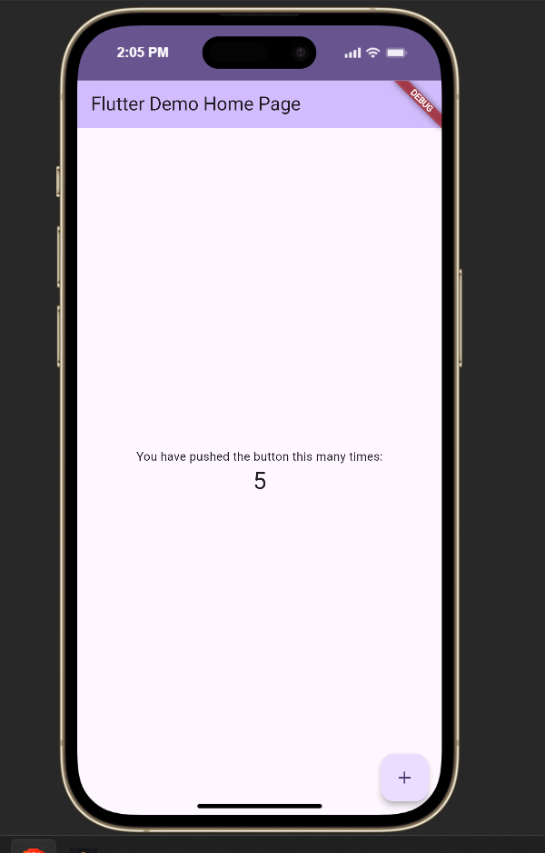

# Week 4 - Networking & REST API

Aplikasi sederhana ini dibuat untuk memenuhi tugas mata kuliah Pemrograman Mobile (Praktikum 4 & 5). Aplikasi ini mendemonstrasikan cara mengambil data dari REST API publik (JSONPlaceholder) dan menampilkannya di aplikasi Flutter dengan arsitektur yang rapi.

## 🌟 Fitur Utama
1. **Pengambilan Data (Networking)**: Terhubung ke JSONPlaceholder `/posts` menggunakan package `dio`.
2. **Arsitektur yang Rapi**: Memisahkan lapisan UI, Provider, Repository, dan Model.
3. **Konfigurasi Dio Terpusat**: Menerapkan Base URL, Timeouts, dan Logging Interceptor di satu tempat.
4. **State Management & Error Handling**: Menggunakan `flutter_riverpod` (`AsyncNotifier`) untuk mengatur *state* (Loading, Success, Error, Empty) dengan penanganan *error* yang ramah pengguna.
5. **Pagination (Infinite Scroll)**: Memuat data secara bertahap (10 item per halaman) saat pengguna men-scroll ke bagian bawah layar, dilengkapi dengan proteksi *request* ganda.
6. **Unit Testing**: Terdapat *unit testing* untuk memastikan parsing JSON (`model`) aman dari nilai null, dan *testing provider* menggunakan *Mock Repository* tanpa membutuhkan koneksi internet sungguhan.
7. **Navigasi**: Dilengkapi fitur pindah halaman menggunakan `go_router` untuk melihat *Detail Post*.

## 🛠️ Stack Teknologi
*   **Flutter & Dart**: Framework & Bahasa Pemrograman utama.
*   **Dio**: HTTP Client untuk melakukan *request* API.
*   **Riverpod**: State management untuk mengatur *async state*.
*   **GoRouter**: Mengatur navigasi dan *routing* halaman.
*   **Flutter Test**: Menguji kebenaran logika kode.

## 🚀 Cara Menjalankan
1. Pastikan Anda sudah meng-install Flutter SDK.
2. Buka terminal pada *root folder* proyek ini.
3. Jalankan `flutter pub get` untuk mengunduh semua dependencies.
4. Jalankan `flutter run` untuk membuka aplikasi di emulator atau *browser*.
5. (Opsional) Jalankan `flutter test` untuk melihat hasil unit test.

## 📁 Struktur Folder
```text
/
├── lib/
│   ├── data/
│   │   ├── models/post.dart          (Model Data)
│   │   ├── repositories/post...      (Logika Fetch API)
│   │   ├── api_client.dart           (Konfigurasi Dio)
│   │   ├── network_errors.dart       (Penerjemah Error)
│   │   ├── paged_posts.dart          (Logika Pagination)
│   │   └── providers.dart            (Riverpod Providers)
│   ├── pages/
│   │   ├── paged_post_page.dart      (UI Halaman Daftar Post)
│   │   └── post_detail_page.dart     (UI Halaman Detail Post)
│   ├── widgets/
│   │   └── post_tile.dart            (Widget Item Baris)
│   └── main.dart                     (Entry Point & Router)
├── test/
│   └── post_test.dart                (Unit & Mock Testing)
├── docs/                             (Dokumentasi AI & Refleksi)
└── README.md
```

## 📸 Screenshots & Penjelasan Singkat
Berikut adalah beberapa tangkapan layar dari aplikasi beserta fungsinya:

### 1. Tampilan Daftar Post


> Menampilkan daftar post (10 item pertama) yang berhasil diunduh dari JSONPlaceholder menggunakan Dio. *State*-nya dikelola secara reaktif menggunakan `flutter_riverpod`.

### 2. Fitur Infinite Scroll (Pagination)


> Terdapat indikator *loading* bundar di bagian bawah layar. Ini menandakan aplikasi sedang menarik halaman data berikutnya secara otomatis saat pengguna men-*scroll* ke ujung bawah tanpa menghapus data sebelumnya.

### 3. Halaman Detail Post (GoRouter)


> Memanfaatkan package `go_router` untuk berpindah halaman. Halaman ini bertugas untuk menampilkan judul dan teks *body* secara utuh berdasarkan item yang diklik dari daftar.

### 4. Handling Error & State


> Tampilan yang ramah pengguna apabila koneksi internet terputus atau terjadi gangguan *server*. Dilengkapi dengan terjemahan error ke bahasa Indonesia dan tombol "Coba lagi" untuk melakukan *retry*.
