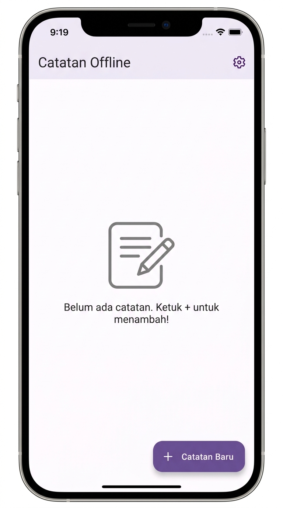
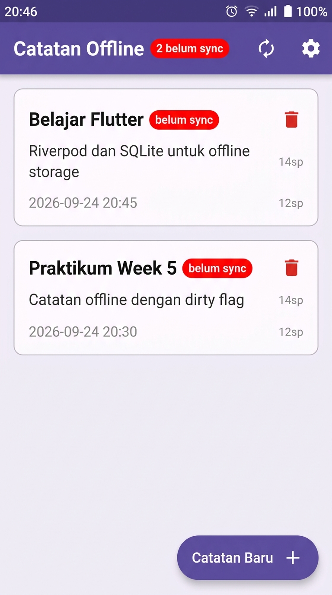
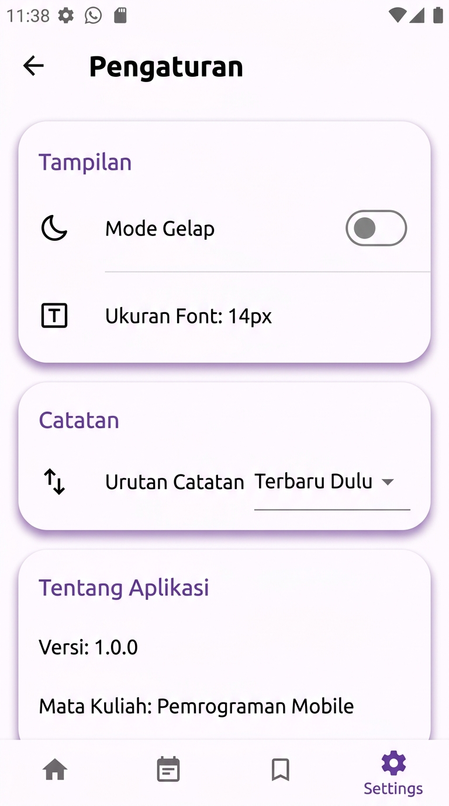

# Week 5 – Offline Notes 📒

> **Mata Kuliah:** Pemrograman Mobile  
> **NIM:** 254107023007  
> **Topik:** Penyimpanan Lokal (SQLite + SharedPreferences) & Riverpod

Aplikasi catatan offline yang bekerja penuh tanpa koneksi internet, dilengkapi mekanisme sinkronisasi (*dirty-flag queue*).

---

## 📸 Screenshots

| Halaman Utama (Kosong) | Halaman Utama (Ada Catatan) | Halaman Pengaturan |
|:---:|:---:|:---:|
|  |  |  |

---

## 🏗️ Struktur Folder

```
lib/
├── main.dart
├── data/
│   ├── local/
│   │   ├── note.dart          # Model Note (+ field dirty)
│   │   └── db.dart            # openNotesDb() – SQLite
│   ├── prefs.dart             # PrefsRepository – SharedPreferences
│   └── repositories/
│       └── note_repository.dart  # CRUD + syncNotes()
└── pages/
    ├── notes_page.dart        # Halaman utama + providers
    └── settings_page.dart     # Dark mode + forceOffline provider
```

---

## ✨ Fitur

- 📝 **Buat, baca, hapus catatan** – tersimpan lokal via SQLite
- 🔴 **Badge "belum sync"** – setiap catatan baru ditandai `dirty = true`
- 🔄 **Simulasi sinkronisasi** – `syncNotes()` mensimulasikan upload ke server
- 🌙 **Dark mode** – tersimpan di SharedPreferences
- ✈️ **Simulasi offline** – toggle `forceOffline` tanpa perlu mode pesawat
- 🧪 **Unit test** – `FakeNoteRepository` tanpa SQLite sungguhan

---

## 🗄️ Skema Database

```sql
CREATE TABLE notes (
  id         INTEGER PRIMARY KEY AUTOINCREMENT,
  title      TEXT    NOT NULL,
  body       TEXT    NOT NULL DEFAULT '',
  updated_at TEXT    NOT NULL,
  dirty      INTEGER NOT NULL DEFAULT 0
);

CREATE TABLE cached_posts (
  id        INTEGER PRIMARY KEY,
  payload   TEXT NOT NULL,
  cached_at TEXT NOT NULL
);
```

---

## 🔁 Alur Sync

```
Tambah catatan → dirty = 1
       ↓
Tekan tombol Sync → syncNotes()
       ↓
Hitung dirty → simulasi delay 1 detik → markAllSynced()
       ↓
dirty = 0 → badge hilang
```

---

## 🧪 Menjalankan Test

```bash
flutter analyze
flutter test
```

---

## 🚀 Menjalankan Aplikasi

```bash
flutter pub get
flutter run
```
