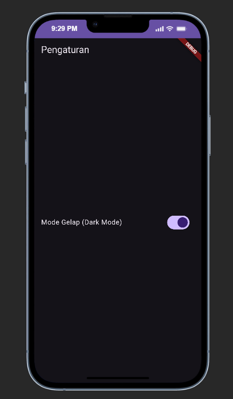

# Offline Notes App (Week 5 Codelab)

Aplikasi pencatatan (Notes) sederhana berprinsip **Offline-First**, di mana catatan akan disimpan secara lokal di perangkat dan secara asinkron (background) akan disinkronisasikan.

## Fitur Utama
1. **Preferences Theme (SharedPreferences)**: Fitur peralihan tema terang/gelap (Dark/Light mode) yang dipertahankan antar sesi (persistent).
2. **Local Storage (SQLite)**: Create, Read, Delete (CRUD) catatan. Semua data disimpan secara lokal dan langsung bisa ditampilkan dalam mode pesawat (offline-first).
3. **Sinkronisasi (Simulasi)**: Indikator/Badge angka untuk antrean catatan yang belum tersinkronisasi (kotor/dirty) ke server.
4. **Desktop Support**: Disempurnakan menggunakan `sqflite_common_ffi` sehingga dapat dieksekusi sebagai aplikasi Native Windows.

## Teknologi (Tech Stack)
- **Flutter** (Framework)
- **Riverpod** (`flutter_riverpod`) (State Management)
- **SharedPreferences** (`shared_preferences`) (Key-Value Storage untuk Pengaturan)
- **SQLite** (`sqflite` & `sqflite_common_ffi`) (Database Relasional Lokal untuk Catatan)

## Cara Menjalankan
Karena proyek ini mengimplementasikan package `sqflite_common_ffi` agar kompatibel dan mudah dijalankan di PC/Laptop sebagai desktop app, Anda dapat menjalankannya dengan perintah:

```bash
flutter run -d windows
```

Atau jika di Mac/Linux:
```bash
flutter run -d macos
# / linux
```

*(Untuk Android/iOS, plugin `sqflite` bawaan sudah disertakan).*

## Hasil / Screenshot

Aplikasi ini membuktikan konsep **Offline-First**, artinya aplikasi tetap bisa dipakai lancar meskipun internet mati. Berikut adalah dokumentasinya:

### 1. Tampilan Awal & Mode Offline
Catatan tetap tampil, dan ada mode saklar (toggle) untuk menyalakan simulasi sedang *Offline* / tidak ada internet.


### 2. Catatan "Kotor" (Belum Disinkron)
Jika kita membuat catatan tapi internet mati (atau server lambat), catatan tetap disimpan dengan aman secara lokal di SQLite. Ini ditandai dengan **Awan Oranye** dan **Badge Angka** (antrean yang belum disinkron).


### 3. Sukses Disinkronisasi
Setelah internet menyala dan kita menekan tombol Sinkronisasi, semua catatan akan masuk ke server (simulasi) dan tandanya berubah menjadi **Centang Hijau** dengan badge kembali kosong.


## Referensi
Silakan lihat folder `docs/refleksi.md` untuk refleksi jawaban, perbandingan storage (SharedPreferences vs Hive vs SQLite vs Drift), serta dokumentasi tantangan AI.
